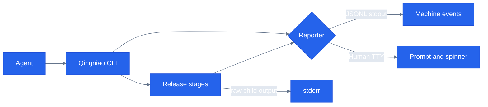

# RFC 0006: Qingniao Agent CLI Protocol

**状态**: Accepted  
**作者**: Codex  
**创建日期**: 2026-08-16  
**最后更新**: 2026-08-16  
**依赖**: 无；扩展现有 Qingniao CLI 公开行为

**变更历史**:

- 2026-08-16: 创建 Agent 可解析 CLI 协议草案。
- 2026-08-16: 批准并实现 JSONL CLI、只读 plan、JSON doctor 与显式授权门禁。

## 黄金法则 (Golden Rules)

- 所有新增代码必须达到 100% lines、functions、branches、statements 覆盖率。
- `--json` 不得破坏现有交互式人类 CLI。
- stdout 是机器协议；诊断和子进程原始输出只能写入 stderr。
- 发布是有副作用操作；Agent 必须显式传入 `--yes`，协议不得隐式确认。

## Goal

让 Agent 能发现 Qingniao 能力、检查发布条件、预览发布计划，并以稳定、可解析、非交互方式执行发布或接收准确失败信息。

## Problem

当前 CLI 以 inquirer、ora spinner 和自然语言输出为中心。Agent 无法可靠地区分进度、警告、错误和最终结果；`--silent`、`--verbose` 已声明但未形成机器接口。失败诊断虽已改进，仍不是可承诺的结构化协议。

## Scope

### In-Scope

- 根发布命令、`doctor` 和新增只读 `plan` 命令支持 `--json`。
- 定义版本化 JSON Lines（JSONL）事件协议。
- 定义成功、失败、跳过、检查结果、发布计划的数据结构与稳定退出码。
- `--json` 模式强制无交互；缺少 `--yes` 时返回结构化确认需求，不修改工作区。
- 更新 `--help`、README 和 Qingniao 文档，提供 Agent 调用范例。
- 为 human 与 JSON reporter 建立独立边界，禁止业务阶段直接调用 `ora` 或 `console`。

### Out-of-Scope

- 自动执行发布而不经过 `--yes`。
- 绕过 Git hooks、认证、构建、测试或发布前检查。
- 远程 Agent 服务、HTTP API、后台守护进程。
- 修改项目发布策略、NPM OTP 或 Git 凭据模型。

## Proposal

### Commands

```text
qingniao --help
qingniao doctor --json
qingniao plan --json
qingniao --json --yes
qingniao --json --yes --dry-run
```

`--help` 保留 Commander 标准帮助。`doctor --json` 只检查。`plan --json` 只发现 packages、配置、版本策略和将运行的阶段，不写文件、不提交、不发布。根命令的 `--json --yes` 才允许执行已有发布流程。

### JSONL contract

stdout 每行是一个完整 JSON 对象，禁止 spinner、颜色、自然语言或子进程输出。所有事件包含：

```json
{
    "schemaVersion": 1,
    "event": "stage",
    "stage": "verify",
    "status": "started",
    "timestamp": "2026-08-16T17:00:00.000Z"
}
```

事件种类：

| event    | Required fields                               | Meaning                                     |
| -------- | --------------------------------------------- | ------------------------------------------- |
| `stage`  | `stage`, `status`                             | `started`, `succeeded`, `failed`, `skipped` |
| `check`  | `check`, `status`                             | doctor 或验证结果                           |
| `plan`   | `packages`, `actions`, `requiresConfirmation` | 无副作用计划                                |
| `result` | `status`, `exitCode`, `summary`               | 唯一终结事件                                |
| `error`  | `code`, `message`, `command?`, `output?`      | 可诊断失败                                  |

`result` 必须是 stdout 最后一行。错误退出前必须写 `error` 和失败 `result`。`schemaVersion` 只在不兼容变更时递增。

### Error boundary

所有阶段通过 reporter 发出结构化事件；`exec` 继续保留原始 command output。JSON 模式下，机器字段写 stdout `error` 事件，完整原始子进程输出写 stderr。Human 模式保留当前 locale 行为和单次错误输出。

错误码：`0` 成功、`1` 执行或检查失败、`2` 用法或配置错误、`3` 需要显式确认、`4` 认证失败。Agent 先读 `error.code`，再读 `message` 和 `command`；不得依赖英文文本解析。

### Backward compatibility

不带 `--json` 的命令保持当前 prompts、spinner、locale 和退出语义。`--json` 与 `--silent` 不允许同时出现；组合时以用法错误退出。`--json` 自动禁用颜色和 prompt，但不等于 `--yes`。

## Data Flow



## Core Deliverables

- `AgentReporter`、`HumanReporter` 与版本化 JSONL 类型。
- `--json` 选项和 `plan` 子命令。
- `doctor --json` 结构化输出。
- Agent CLI 文档、help 文案和使用范例。
- 成功、失败、确认需求、计划只读性、stdout 纯 JSONL 的回归测试。

## Success Criteria

- `qingniao --json --yes --dry-run` 的 stdout 可逐行 `JSON.parse`，且最后一行是 `result`。
- `qingniao plan --json` 运行前后 `git diff --exit-code` 为 0。
- `qingniao --json` 无 `--yes` 时退出码为 3，且不写版本、不提交、不发布。
- 所有 JSON 模式错误带非空 `code`、`message`，命令错误另带 `command`。
- Human CLI 现有测试全部保持通过。
- 新增模块与分支达到 100% 覆盖率；lint、typecheck、test、format 全部通过。

## Implementation Plan

### Phase 1: Protocol boundary

1. **Step 1.1**: 在 `packages/@systembug/qingniao/src/reporters/types.ts` 定义 `JsonEvent`、终结事件和错误码联合类型。  
   **Expected output**: 版本化、无 `any` 的 JSONL schema。  
   **Tests**: 覆盖所有 event 与 error code 分支。
2. **Step 1.2**: 在 `src/reporters/` 实现 `HumanReporter` 与 `JsonReporter`。  
   **Expected output**: JSON reporter 只写 stdout JSONL；human reporter 保持 ora 输出。  
   **Tests**: stdout/stderr 分离、每行可解析、终结事件唯一且最后。
3. **Step 1.3**: 改造 `src/core/executor.ts` 与 stages，使其依赖 reporter，不直接输出 UI。  
   **Expected output**: 执行阶段的 started/succeeded/failed/skipped 事件。  
   **Tests**: 每个阶段成功、跳过和失败事件顺序。

### Phase 2: Agent commands and safety

1. **Step 2.1**: 在 `src/cli.ts` 增加 `--json`，并在 JSON 模式禁用颜色和 prompt。  
   **Expected output**: 无 `--yes` 的副作用命令返回 exit code 3 与 `confirmation_required` error。  
   **Tests**: CLI 集成测试验证退出码、无 prompt、无工作区写入。
2. **Step 2.2**: 在 `src/commands/plan.ts` 实现只读计划生成。  
   **Expected output**: `plan --json` 返回 packages、版本策略、actions 和确认需求。  
   **Tests**: fixture workspace；命令运行前后文件哈希相同。
3. **Step 2.3**: 扩展 `src/commands/doctor.ts` 输出 JSON 检查事件。  
   **Expected output**: 与 human doctor 相同检查语义。  
   **Tests**: 正常、warning、strict failure 和配置缺失。

### Phase 3: Documentation and compatibility

1. **Step 3.1**: 更新 `packages/@systembug/qingniao/README.md` 与 `docs/tools/qingniao.md`。  
   **Expected output**: Agent safe release sequence 与 JSONL schema reference。  
   **Tests**: 文档命令在 fixture workspace 运行。
2. **Step 3.2**: 运行全包测试、coverage、lint、typecheck、format。  
   **Expected output**: 所有质量门禁 exit code 0。  
   **Tests**: `pnpm --filter @systembug/qingniao test:coverage`、lint、typecheck、format check。

## Risks

- 直接在既有 stages 中散布 JSON `console.log` 会再次制造重复输出。必须只通过 reporter。
- stdout 中任意子进程文本都会破坏 JSONL。JSON 模式必须重定向子进程输出到 stderr。
- `--json` 被误当作批准发布会破坏用户空间。批准只能来自显式 `--yes`。
- 终结事件缺失会使 Agent 无法判断结果。CLI 顶层必须负责唯一终结事件。

## Alternatives

1. **只增加 `--json` 最终摘要**：改动小，但 Agent 无进度、无法定位阶段失败。拒绝。
2. **输出单个 JSON 文档**：结构简单，但不能流式报告长构建。拒绝。
3. **JSONL reporter + 只读 plan**：稳定、可流式解析、发布前可审查。推荐。

## Acceptance Gate

实现的 Agent 入口：`plan --json`、`doctor --json`、`--json --yes`。全仓历史覆盖率基线为 21.11%，因此 100% 全包覆盖率门禁尚未满足；RFC 保持 Accepted，不能标记 Implemented。
