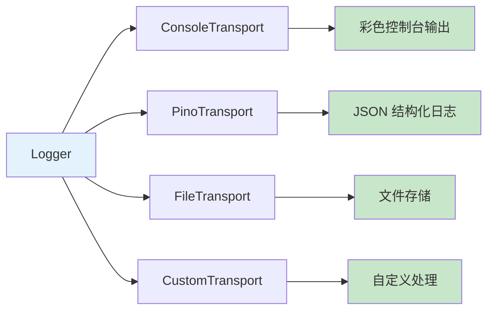
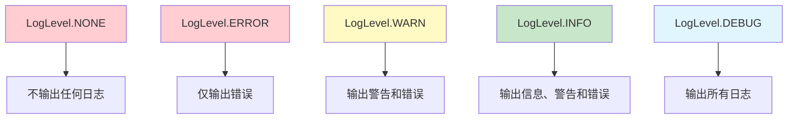

# 谛听 (Diting)

> **春眠不觉晓，处处闻啼鸟。**
> **夜来风雨声，花落知多少。**
> —— 孟浩然《春晓》

🌌 谛听 - 平台中立的日志库，使用 chalk 和 pino 进行日志记录

## 📖 关于谛听

谛听是地藏菩萨的坐骑，具有"能听万物"的神通，能够听到三界六道中的一切声音，辨别真伪，记录善恶。正如神话中的谛听能够听万物、辨真伪、记录善恶，谛听日志库也致力于：

- **听万物**：记录应用程序中的所有事件和信息
- **辨真伪**：通过日志级别区分不同重要程度的信息
- **记录善恶**：记录成功与失败，帮助开发者追踪问题
- **静观世间**：在生产环境中可自动禁用，保持静默

## ✨ 特性

- ✅ 平台中立（Node.js + 浏览器）
- ✅ TypeScript 支持
- ✅ 多日志级别（DEBUG, INFO, WARN, ERROR）
- ✅ 使用 chalk 进行彩色输出
- ✅ 使用 pino 进行结构化日志记录
- ✅ 可插拔传输器
- ✅ 上下文支持
- ✅ 生产环境自动禁用日志
- ✅ ESM + CJS 双格式

## 📦 安装

```bash
pnpm add @systembug/diting
# 或
npm install @systembug/diting
# 或
yarn add @systembug/diting
```

## 🚀 快速开始

### 基本用法

```typescript
import { createLogger, LogLevel } from "@systembug/diting";

const logger = createLogger({
    level: LogLevel.INFO,
    context: "MyApp",
});

logger.debug("调试信息"); // 不会输出（级别低于INFO）
logger.info("普通信息");
logger.warn("警告信息");
logger.error("错误信息");
```

### 带上下文的子 Logger

```typescript
const logger = createLogger({ context: "App" });
const dbLogger = logger.child("Database");

dbLogger.info("连接成功"); // 输出: [App:Database] 连接成功
```

## 🎨 彩色输出

默认的 `ConsoleTransport` 使用 chalk 进行彩色输出，不同级别的日志会显示不同的颜色：

- **DEBUG**: 灰色
- **INFO**: 蓝色
- **WARN**: 黄色
- **ERROR**: 红色

时间戳和上下文也会使用适当的颜色进行高亮显示。

## 📊 结构化日志

使用 `PinoTransport` 可以输出结构化的 JSON 日志，便于日志收集和分析：

```typescript
import { Logger, PinoTransport } from "@systembug/diting";

const logger = new Logger({
    transports: [
        new PinoTransport({
            level: "debug",
        }),
    ],
});

logger.info("用户登录", { userId: 123, ip: "192.168.1.1" });
// 输出: {"level":30,"time":1234567890,"msg":"用户登录","userId":123,"ip":"192.168.1.1"}
```

## 🔌 自定义传输器

```typescript
import { Logger, LogTransport, LogEntry } from "@systembug/diting";

class FileTransport implements LogTransport {
    log(entry: LogEntry): void {
        // 写入文件
        fs.appendFileSync("app.log", JSON.stringify(entry) + "\n");
    }
}

const logger = new Logger({
    transports: [new FileTransport()],
});
```

## 🔄 组合使用多个传输器

可以同时使用多个传输器，例如同时输出到控制台（彩色）和文件（结构化）：



```typescript
import { Logger, ConsoleTransport, PinoTransport } from "@systembug/diting";
import fs from "fs";

const logger = new Logger({
    transports: [
        new ConsoleTransport(), // 彩色控制台输出
        new PinoTransport({
            transport: {
                target: "pino/file",
                options: { destination: "./logs/app.log" },
            },
        }),
    ],
});
```

## 🌍 生产环境

在生产环境下（`NODE_ENV=production`），所有日志会自动禁用。

也可以手动控制：

```typescript
const logger = createLogger({
    isProduction: true, // 强制禁用日志
});
```

## 📊 日志级别

谛听支持以下日志级别：



## 📖 API 参考

### LogLevel

```typescript
enum LogLevel {
    DEBUG = 0,
    INFO = 1,
    WARN = 2,
    ERROR = 3,
    NONE = 4,
}
```

### Logger 方法

- `debug(message, ...args)` - 记录调试日志
- `info(message, ...args)` - 记录信息日志
- `warn(message, ...args)` - 记录警告日志
- `error(message, ...args)` - 记录错误日志
- `setLevel(level)` - 设置日志级别
- `getLevel()` - 获取日志级别
- `child(context)` - 创建子Logger
- `isProduction()` - 检查是否为生产环境

### 传输器

#### ConsoleTransport

默认的控制台传输器，使用 chalk 进行彩色输出。

```typescript
import { ConsoleTransport } from "@systembug/diting";

const logger = new Logger({
    transports: [new ConsoleTransport()],
});
```

#### PinoTransport

基于 pino 的结构化日志传输器，支持 JSON 格式输出。

```typescript
import { PinoTransport } from "@systembug/diting";

const logger = new Logger({
    transports: [
        new PinoTransport({
            // pino.LoggerOptions
        }),
    ],
});
```

#### MemoryTransport

内存传输器，主要用于测试。

```typescript
import { MemoryTransport } from "@systembug/diting";

const transport = new MemoryTransport();
const logger = new Logger({
    transports: [transport],
});

logger.info("test");
const entries = transport.getEntries();
transport.clear();
```

## 📄 License

MIT
