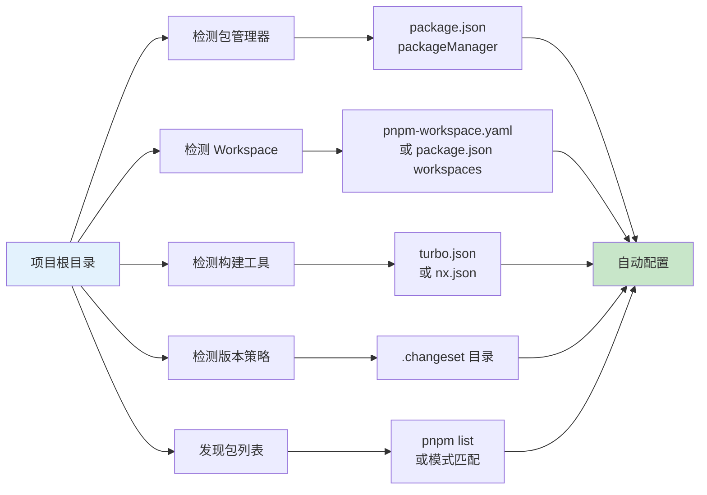
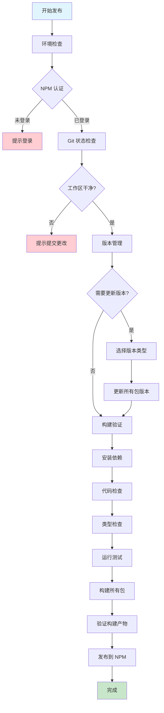

# 青鸟 (Qingniao)

> **相见时难别亦难，东风无力百花残。**
> **春蚕到死丝方尽，蜡炬成灰泪始干。**
> **晓镜但愁云鬓改，夜吟应觉月光寒。**
> **蓬山此去无多路，青鸟殷勤为探看。**
> —— 李商隐《无题》

🌌 青鸟 - 零配置优先的通用发布工具，专为 monorepo 项目设计

## 📖 关于青鸟

青鸟是中国神话中西王母的信使，负责将消息和物品准确、及时地传递到人间。正如李商隐《无题》所描绘："蓬山此去无多路，青鸟殷勤为探看"，青鸟工具如诗中的信使一般，殷勤地将您的代码包准确、优雅地传递到 NPM 仓库，即使前路遥远，也必使命必达。

## ✨ 核心特性

### 🎯 零配置优先

- **自动检测**：自动检测包管理器、workspace 类型、构建工具（Turbo/Nx）
- **智能推断**：从项目结构自动推断构建步骤、产物路径、版本策略
- **开箱即用**：大多数项目无需配置文件即可使用

### 🚀 深度集成

- **pnpm/yarn/npm workspace**：完整支持，自动处理依赖顺序
- **Changeset**：深度集成，自动检测和使用 changeset
- **Turbo/Nx**：自动检测并使用构建工具的依赖图
- **Git**：自动处理版本提交、标签创建、远程推送

### ⚙️ 灵活配置

- **配置文件可选**：仅在需要时覆盖自动检测结果
- **部分覆盖**：只需配置需要自定义的部分
- **多种格式**：支持 JSON、JavaScript、TypeScript 配置文件

## 📦 安装

```bash
# 全局安装
npm install -g @systembug/qingniao

# 或项目本地安装
pnpm add -D @systembug/qingniao
# 或
npm install --save-dev @systembug/qingniao
# 或
yarn add -D @systembug/qingniao
```

### 可选依赖

如果使用 changeset 进行版本管理，需要单独安装 `@changesets/cli`：

```bash
pnpm add -D @changesets/cli
```

## 🚀 快速开始

### 零配置使用（推荐）

在标准 monorepo 项目中，直接运行：

```bash
qingniao
# 或使用简短命令
qn
```

工具会自动：

- 检测 pnpm/yarn/npm workspace
- 发现所有可发布的包（自动排除私有包）
- 检测并使用 changeset（如果存在）
- 从 package.json 推断构建步骤
- 自动处理版本管理和发布

### 在 package.json 中添加脚本

```json
{
  "scripts": {
    "release": "qingniao",
    "release:dry-run": "qingniao --dry-run"
  }
}
```

然后运行：

```bash
pnpm release
```

## 🎯 零配置自动检测

青鸟工具会自动检测以下信息，**无需任何配置文件**：



### 自动检测项

- ✅ **包管理器**：从 `package.json` 的 `packageManager` 字段检测
- ✅ **Workspace 类型**：从 `pnpm-workspace.yaml`、`package.json` workspaces 自动检测
- ✅ **包列表**：使用包管理器命令自动发现所有包
- ✅ **包过滤**：自动排除私有包（`private: true`）和无效配置的包
- ✅ **版本策略**：检测 `.changeset` 目录，自动选择 changeset 或 manual 策略
- ✅ **构建工具**：从 `turbo.json` 或 `nx.json` 自动检测 Turbo/Nx
- ✅ **构建步骤**：从 `package.json` scripts 自动生成构建步骤
- ✅ **构建产物路径**：从每个包的 `package.json` 自动推断（main/module/types 字段）
- ✅ **Git 分支**：自动检测当前分支
- ✅ **依赖顺序**：自动分析 workspace 依赖关系，拓扑排序

### 包发布验证

青鸟会自动验证每个包的发布配置：

- ✅ 检查是否为私有包（自动排除）
- ✅ 对于 scoped packages（如 `@systembug/xxx`），检查 `publishConfig.access` 是否为 `"public"`
- ✅ 显示详细的验证错误和警告

## 📋 发布流程

青鸟的发布流程如下：



### 详细步骤

1. **环境检查**
   - NPM 认证检查
   - Git 状态检查（工作区干净）
   - 远程同步检查

2. **版本管理**（可选）
   - 选择版本类型（major/minor/patch）
   - 更新所有包的版本号（包括根目录）
   - 同步 workspace 依赖版本
   - 提交到 Git 并创建标签

3. **构建验证**
   - 清理构建产物
   - 安装依赖
   - 代码检查（ESLint）
   - 类型检查（TypeScript）
   - 运行测试
   - 构建所有包（Turbo/Nx）
   - 验证构建产物

4. **发布到 NPM**
   - 显示将要发布的包列表
   - 检查已存在的版本
   - Dry-run 测试（可选）
   - 正式发布

## 🎯 使用示例

### 基本发布

```bash
# 1. 确保代码已提交
git add .
git commit -m "feat: 新功能"

# 2. 运行发布
pnpm release

# 3. 按照提示操作
# - 选择是否更新版本
# - 选择版本类型（major/minor/patch）
# - 确认发布
```

### 跳过版本更新

```bash
# 只发布，不更新版本
qingniao --skip-version
```

### 仅验证构建

```bash
# 不发布，只验证构建
qingniao --skip-publish
```

### 非交互模式（CI/CD）

```bash
# 跳过所有确认提示
qingniao --yes
```

### Dry-run 模式

```bash
# 执行完整流程但不实际发布
qingniao --dry-run
```

## 🔧 自定义配置（可选）

**默认情况下，完全不需要配置文件！** 所有配置都自动检测。

如果确实需要覆盖某些自动检测的结果，可以创建 `qingniao.config.json`：

```json
{
    "git": {
        "branch": "develop" // 覆盖：默认自动检测当前分支
    },
    "build": {
        "steps": [
            // 覆盖：默认从 package.json scripts 自动生成
        ]
    }
}
```

### 配置文件优先级

1. 命令行 `--config` 指定的文件
2. `qingniao.config.json`（如果存在）
3. `package.json` 中的 `qingniao` 字段（如果存在）
4. **零配置自动检测**（默认，推荐）

### 完整配置示例

```typescript
// qingniao.config.ts
import { PublishConfig } from "@systembug/qingniao";

export default {
    project: {
        name: "My Project",
        packageManager: "pnpm",
    },
    git: {
        branch: "main",
        tagPrefix: "v",
    },
    version: {
        strategy: "changeset",
        syncAll: true,
    },
    build: {
        useNx: true, // 或 useTurbo: true
        nxTargets: ["build"], // 或 turboTasks: ["build"]
    },
    publish: {
        skipExisting: true,
    },
} satisfies PublishConfig;
```

## 🔍 核心功能详解

### 版本管理

- **Changeset 集成**：自动检测和使用 changeset
- **手动版本**：支持 major/minor/patch 手动选择
- **版本同步**：自动同步所有 workspace 包的版本（包括根目录）
- **Workspace 协议**：自动替换 `workspace:*` 为实际版本

### 构建验证

- **自动推断**：从 package.json scripts 自动生成构建步骤
- **产物验证**：自动检测和验证构建产物
- **依赖顺序**：按依赖关系拓扑排序构建
- **Pre-lint 构建**：支持在 lint 之前构建特定包（如 eslint-plugin）

### NPM 发布

- **智能发布**：按依赖顺序发布包
- **Dry-run 支持**：发布前验证
- **OTP 支持**：自动处理 2FA 认证
- **错误处理**：详细的错误信息和恢复建议

## 🎨 青鸟哲学

正如古诗所描绘的，青鸟作为信使具有以下特质：

- **殷勤**：主动检测和推断，无需繁琐配置
- **可靠**：确保版本同步、依赖正确、构建完整
- **优雅**：提供流畅的发布体验，如青鸟飞行般优雅
- **智能**：自动处理复杂逻辑，让开发者专注于代码

## 📚 相关文档

- [RFC 0001: 青鸟通用发布工具设计规范](../rfc/0001-universal-publish-tool.md)

---

> **蓬山此去无多路，青鸟殷勤为探看**
> 让代码发布如青鸟传递消息般优雅流畅！

